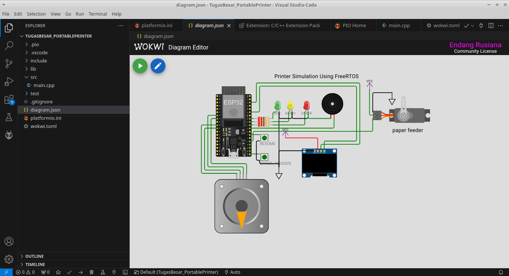

# Portable Printer Simulation  

Simulasi portable printer menggunakan VSCode.  
1. file diagram.json di edit pakai notepad untuk gambar rangkaian. 
2. file wokwi.toml dibuat sebagai pengaturan simulasi. 
3. wokwi extension yang digunakan adalah versi 2.0.1 karena jika menggunakan versi terbaru maka terdapat bug tidak bisa mengirim input di serial terminal. 

